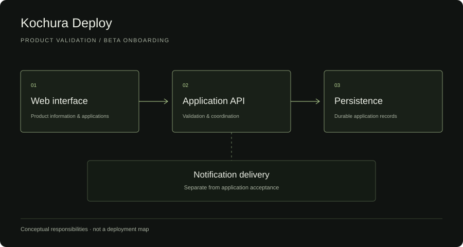

# Kochura Deploy

**Product engineering / Backend / Linux infrastructure**
An engineering overview by [Elisey Kochura](https://github.com/lolpul).

## Project overview

Kochura Deploy explores a simpler way for small teams to deploy and operate bots and small applications. Its current implementation is a product website and a working beta-application API: a focused first step toward understanding requirements before building a deployment platform.

**Stage:** product validation and beta onboarding. Automated application deployment, a self-service dashboard and billing are future work, not delivered capabilities.

The engineering problem at this stage is to build a reliable path from a visitor's interest to a recorded application, while keeping the surrounding application and infrastructure small enough to operate and change safely.

## My role

I developed the product website and application workflow, implemented the backend and persistence layer, and worked on its containerized Linux deployment. My responsibilities span product scope, frontend behavior, backend validation, data handling, testing and infrastructure integration.

## Engineering scope

- A lightweight HTML, CSS and JavaScript frontend.
- A Python / FastAPI backend with validation and application processing.
- SQLite persistence and schema evolution.
- Notification handling that is separate from successful persistence.
- Docker, Linux and reverse-proxy integration.
- Automated API tests, backup checks and deployment verification.

## Architecture

The web interface communicates with an application API. The API validates and stores an application; notification delivery is a separate responsibility. Containerized hosting supports this application stack. This diagram describes responsibilities, not live deployment topology.

## Engineering decisions

| Problem | Decision | Reason / trade-off |
| --- | --- | --- |
| Building a platform before its requirements are understood creates avoidable work. | Start with a product website and beta-application workflow. | Establish a concrete feedback path before investing in orchestration; automated deployment remains future work. |
| A notification outage should not invalidate a successfully received application. | Treat persistence as the acceptance boundary and notifications as a separate operation. | The durable record survives delivery failures; notification state needs its own handling. |
| A small onboarding service still needs durable, maintainable storage. | Use SQLite with explicit migration and backup checks. | Keep the initial operating footprint small; a more complex deployment would require revisiting storage assumptions. |

## Challenges

- Evolving the application form while preserving existing records.
- Handling invalid submissions and notification failures without misleading the visitor.
- Keeping product copy aligned with implemented capabilities.
- Updating a web application while preserving a recovery path for the existing service.

## Validation approach

The private project includes API tests for persistence, invalid input, schema migration and notification failures, together with backup-related checks. This overview makes no adoption, uptime or performance claims.

## Screenshots

No screenshots are included in this edition. The illustration above is a conceptual architecture diagram, not a product UI mockup. The public landing page is linked below.

## Source availability

The production source code is maintained in a private repository. This repository contains a public engineering overview only.

No application source, deployment configuration, internal endpoints, operational data or proprietary implementation is distributed here. Publication of this overview does not license the private product.

## Links

- [Public beta landing page](https://deploy.kochura.com) — product information and an application form, not a self-service deployment console.
- Portfolio case study: pending website publication; planned route `/work/kochura-deploy`.
- [Elisey Kochura on GitHub](https://github.com/lolpul).

*Documentation reviewed: 1 October 2026.*
